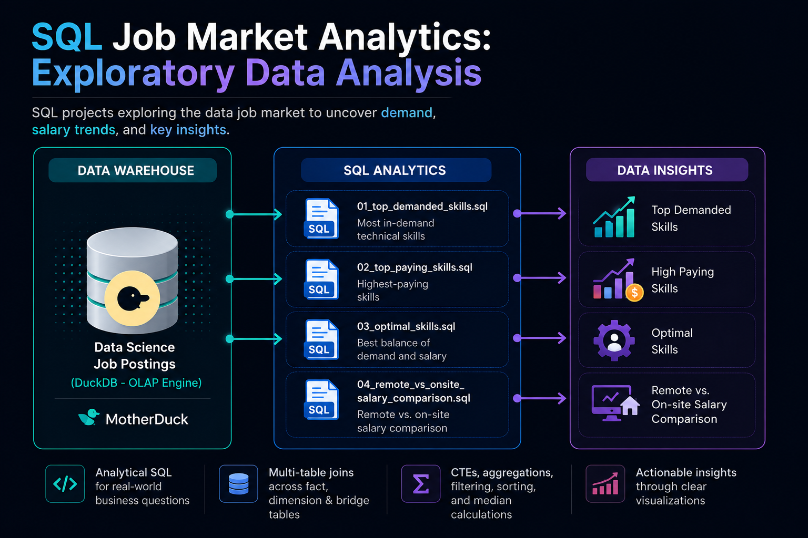
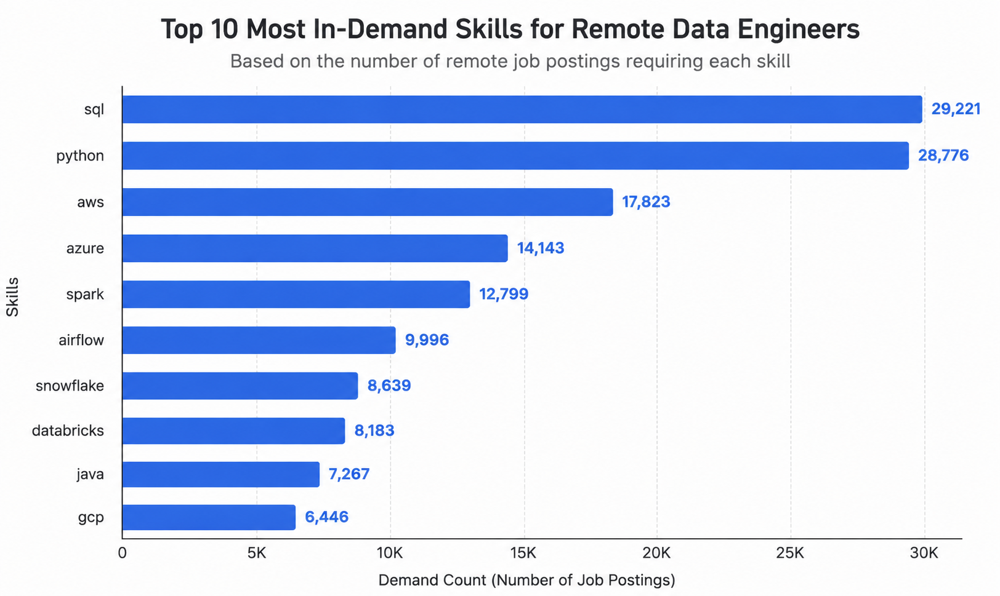
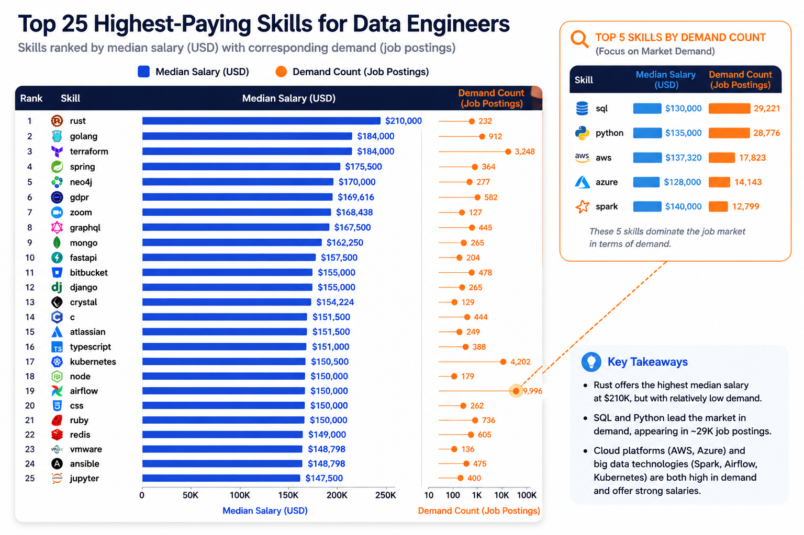
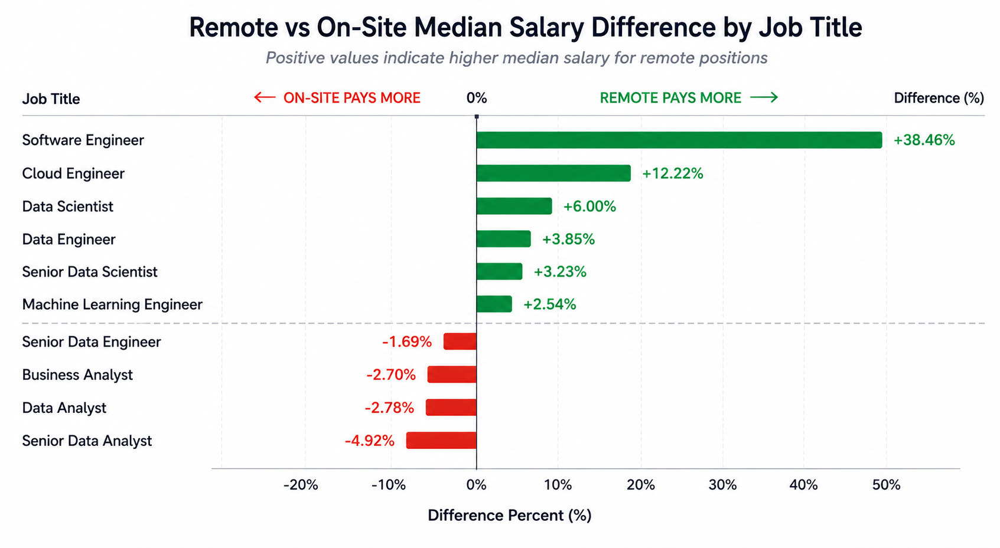

# SQL Job Market Analytics: Exploratory Data Analysis



  A collection of SQL projects focused on data analysis, querying, and business insights using real-world job posting data.

> The goal of the project how SQL can be used to analyze a real-world data warehouse and answer practical business questions through analytical queries.
---

## Highlights
- ✅ Project scope: Built 4 analytical queries that answer key questions about the data job market
- ✅ Used multi-table joins across fact and dimension tables
- ✅ Applied CTEs, aggregations, filtering, sorting, and median calculations
- ✅ Analyzed skill demand, salary trends, and remote vs. on-site compensation
- ✅ Created visualizations to communicate findings

---

## Quick Navigation

| Analysis | Focus |
|----------|-------|
| [01_top_demanded_skills.sql](../1_EDA/01_top_demanded_skills.sql) | Most in-demand technical skills |
| [02_top_paying_skills.sql](../1_EDA/02_top_paying_skills.sql) | Highest-paying skills |
| [03_optimal_skills.sql](../1_EDA/03_optimal_skills.sql) | Best balance of demand and salary |
| [04_remote_vs_onsite_salary_comparison.sql](../1_EDA/04_remote_vs_onsite_salary_comparison.sql) | Remote vs. on-site salary comparison |

## Data Warehouse Schema

The project is built on a relational data warehouse using a star schema with fact, dimension, and bridge tables. This structure enables efficient analytical SQL queries across multiple related datasets.


### Database Structure

| Table | Type | Description |
|--------|------|-------------|
| **job_postings_fact** | Fact Table | Stores job posting information including job title, salary, work schedule, location, remote status, and posting details. |
| **company_dim** | Dimension Table | Contains company-related information such as company name, website, and metadata. |
| **skills_dim** | Dimension Table | Stores individual technical skills and their corresponding categories. |
| **skills_job_dim** | Bridge Table | Resolves the many-to-many relationship between job postings and required skills. |

### Business Questions Addressed

The following sections present four analytical SQL queries, each designed to answer a specific business question about the data job market.

- Which technical skills are most frequently requested by employers?
- Which skills command the highest median salaries?
- Which skills provide the best combination of demand and earning potential?
- How does remote work influence salaries compared to on-site roles?

---

## Analysis 1 – Top Demanded Skills

**Question**

> Which technical skills appear most frequently in job postings?

### SQL Concepts

- JOIN
- GROUP BY
- ORDER BY
- COUNT
- LIMIT

### Result

The analysis identifies the ten most frequently requested technical skills across job postings.



---

## Analysis 2 – Highest Paying Skills

**Question**

> Which skills are associated with the highest median salaries?

### SQL Concepts

- Aggregate Functions
- MEDIAN()
- GROUP BY
- ORDER BY

### Result

Some specialized technologies such as Rust, Terraform, and Golang command the highest salaries, although they appear less frequently than mainstream tools.



---

## Analysis 3 – Optimal Skills

**Question**

> Which skills provide the best balance between demand and salary?

### SQL Concepts

- Common Table Expressions (CTEs)
- Aggregations
- JOIN
- Filtering

### Result

This analysis combines demand and salary data to identify skills that are both valuable and widely requested.

---

## Analysis 4 – Remote vs On-site Salaries

**Question**

> How much more (or less) do remote positions pay compared to on-site roles?

### SQL Concepts

- CTEs
- MEDIAN()
- JOIN
- Calculated Columns

### Result

Median salaries are compared for remote and non-remote positions across job titles to highlight differences in compensation.



---

## 🛠️ Tech Stack

- **Database:** DuckDB (OLAP Engine)
- **Language:** SQL (ANSI SQL)
- **Data Model:** Star Schema (Fact, Dimension & Bridge Tables)
- **Tools:** VS Code, MotherDuck
- **Version Control:** Git & GitHub

---

## 📁 Project Structure

```text

│
├── 1_EDA/
│   ├── 01_top_demanded_skills.sql
│   ├── 02_top_paying_skills.sql
│   ├── 03_optimal_skills.sql
│   └── 04_remote_vs_onsite_salary_comparison.sql
│

└── 
```

---


Thank you for taking the time to explore this project. Feedback and suggestions are always welcome.