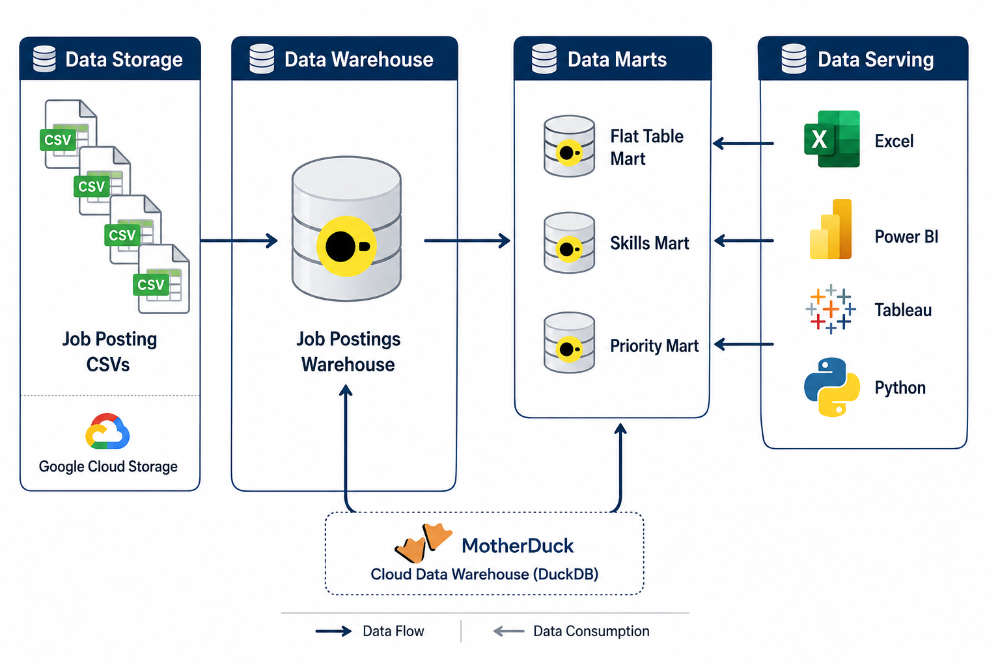

# Data Warehouse & Data Mart Build: Production ETL Pipeline

<p align="center">
  
</p>

An end-to-end SQL data engineering pipeline that transforms raw job posting CSV files into a production-ready analytical data warehouse and multiple business-oriented data marts using DuckDB.

## 🧾 Executive Summary

This project demonstrates the complete lifecycle of building an analytical data warehouse from raw CSV files.

### Key Highlights

- Designed a Star Schema data warehouse using fact, dimension, and bridge tables.
- Built an end-to-end ETL pipeline with idempotent SQL scripts.
- Created multiple analytical data marts optimized for different business scenarios.
- Implemented an incremental update pipeline using SQL `MERGE`.
- Validated data quality through referential integrity and record count checks.

## Quick Navigation

| SQL Script | Purpose |
|------------|---------|
| [01_create_tables_dw.sql](01_create_tables_dw.sql) | Create the dimensional Star Schema (fact, dimension, and bridge tables) |
| [02_load_schema_dw.sql](02_load_schema_dw.sql) | Load and validate warehouse data from raw CSV files |
| [03_create_flat_mart.sql](03_create_flat_mart.sql) | Build a denormalized reporting table for analytics |
| [04_create_skills_mart.sql](04_create_skills_mart.sql) | Create a dimensional mart for monthly skill demand analysis |
| [05_create_priority_mart.sql](05_create_priority_mart.sql) | Build a business-focused priority jobs mart |
| [06_update_priority_mart.sql](06_update_priority_mart.sql) | Incrementally refresh the Priority Mart using `MERGE` |
| [build_marts.sql](build_marts.sql) | Execute the complete ETL pipeline in the correct order |

## 🧩 Business Problem

Raw job posting CSV files are not optimized for analytical workloads.

Business users need to answer questions such as:

- Which technical skills are becoming more popular?
- Which companies hire most frequently?
- How do salaries change across skills and job titles?
- Which roles should recruiters prioritize?

Running these analyses directly on raw files results in repetitive joins, inconsistent calculations, and slow analytical queries.

## 💡 Solution

The project implements a complete SQL-based analytical platform consisting of:

1. Data Warehouse
2. Flat Mart
3. Skills Mart
4. Priority Mart
5. Incremental Update Pipeline

The architecture provides a reusable analytical layer that simplifies reporting while maintaining a single source of truth.


## 🏛 Data Warehouse

<p align="center">
  
</p>

The warehouse follows a dimensional Star Schema designed for analytical workloads.
### SQL Scripts

- **[`01_create_tables_dw.sql`](01_create_tables_dw.sql)** — Creates the warehouse schema, including fact, dimension, and bridge tables.
- **[`02_load_schema_dw.sql`](02_load_schema_dw.sql)** — Extracts data from source CSV files and loads the warehouse while preserving referential integrity.


### Objective

Separate transactional information into reusable fact, dimension, and bridge tables.

### Output

Created tables:

- job_postings_fact
- company_dim
- skills_dim
- skills_job_dim

### Business Value

The warehouse becomes the single source of truth for all downstream analytics while minimizing redundancy and improving query performance.

## 📊 [03_create_flat_mart.sql](03_create_flat_mart.sql)

### Objective

Create a denormalized analytical table by combining job postings, company information, and aggregated skills into a single reporting-friendly structure.

<p align="center">
  
</p>

### Output

Creates:

- `flat_mart.job_postings`

The table contains:

- Job information
- Company information
- Salary metrics
- Location metadata
- Remote work indicator
- Degree requirement indicator
- Health insurance indicator
- Aggregated skills list

### Business Value

The Flat Mart removes repetitive joins across multiple warehouse tables by providing a denormalized, reporting-ready dataset. It is optimized for BI dashboards, ad-hoc reporting, and exploratory analysis where fast query performance and simplified data access are more important than full normalization.

## 📈 [04_create_skills_mart.sql](04_create_skills_mart.sql)

### Objective

Create a dimensional mart for analyzing monthly technical skill demand across different job roles.

### Output

Creates:

- dim_skill
- dim_date_month
- fact_skill_demand_monthly

Measures include:

- Total postings
- Remote postings
- Health insurance mentions
- No-degree mentions

### Business Value

Supports trend analysis, time-series reporting, and skill-demand monitoring without querying raw warehouse tables.

## 🎯 [05_create_priority_mart.sql](05_create_priority_mart.sql)
### Objective

Create a business-focused mart that prioritizes important job opportunities based on demand, salary, and remote availability.

### Output

Creates:

- priority_roles
- priority_jobs_snapshot

### Business Value

Provides recruiters and analysts with a curated list of high-priority opportunities while reducing reporting complexity.

## 🔄 [06_update_priority_mart.sql](06_update_priority_mart.sql)

### Objective

Refresh the Priority Mart incrementally using SQL `MERGE` instead of rebuilding the entire dataset.

### Output

Updates:

- priority_jobs_snapshot

using insert, update, and delete operations.

### Business Value

Demonstrates a production-style incremental loading strategy that minimizes execution time and resource consumption.

## ⚙️ [build_marts.sql](build_marts.sql)

Runs the complete ETL pipeline in the correct execution order.

```text
Create Warehouse
      ↓
Load Warehouse
      ↓
Create Flat Mart
      ↓
Create Skills Mart
      ↓
Create Priority Mart
      ↓
Incremental Update
```

## ✅ Validation

The pipeline includes validation steps to ensure data quality.

Performed checks:

- Referential integrity
- Record counts
- Sample outputs
- Fact-to-dimension consistency
- Mart validation

## 🛠 Tech Stack

- 🐤 **Database:** DuckDB (file-based OLAP database with GCS integration via `httpfs`)

- 🧮 **Language:** SQL (DDL for schema design, DML for data loading and transformation)

- 📊 **Data Model:** Star Schema (fact, dimension, and bridge tables)

- 🛠️ **Development:** VS Code for SQL development and DuckDB CLI for pipeline execution

- 🔧 **Automation:** Master SQL build script for end-to-end pipeline orchestration

- 📦 **Version Control:** Git & GitHub using a feature branch workflow

- ☁️ **Storage:** Google Cloud Storage (GCS) for source CSV files


## 📂 Project Structure

```text
2_DW_Mart_Build
│
├── 01_create_tables_dw.sql
├── 02_load_schema_dw.sql
├── 03_create_flat_mart.sql
├── 04_create_skills_mart.sql
├── 05_create_priority_mart.sql
├── 06_update_priority_mart.sql
└── build_marts.sql
```

Thank you for taking the time to explore this project. Feedback and suggestions are always welcome.